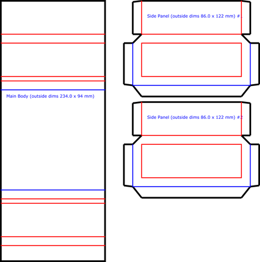

# CBOX - A Seamless Box Template Generator
> 

A Command-Line Interface (CLI) tool to generate customizable SVG templates for making clean, seamless cardboard boxes by hiding the corrugated cross-section.

This project is based on the methods described in this [video from Itoshige
Studio](https://www.youtube.com/@itoshigestudio).

# What is a Seamless Box?

A seamless cardboard box is constructed so that the corrugated edges are hidden, resulting in a clean, professional finish. This script generates the precise cut-and-fold pattern (like the one shown below) based on your desired dimensions and cardboard thickness.

# Installation

This script requires Python 3.7+ and the 'svgwrite' library. It is recommended
to use a virtual environment.

1. Create and Activate a Virtual Environment

    ```
    python3 -m venv .venv
    ```

2. Activate the environment (on macOS/Linux)
    ```
    source .venv/bin/activate   # MacOS/Linux
    # OR
    .\.venv\Scripts\activate    # Windows
    ```


3. Install the Project

    ```
    pip install -e .
    ```

# Usage

Generate a template for a box that is 120mm wide, 120mm deep, and 38mm high, using 4mm thick cardboard, and save the output to 'output.svg':

    ```
    python cbox.py --width 90 --depth 94 --height 30 --thickness 4 --fname example.svg
    ```

Help message:

    ```
    usage: cbox.py [-h] [--length LENGTH] [--width WIDTH] [--height HEIGHT] [--thickness THICKNESS] [--labels | --no-labels]
               [--fname FNAME]

    Generate SVG template for a seamless cardboard box.

    options:
      -h, --help            show this help message and exit
      --length LENGTH, -l LENGTH
                            Interior length (mm) [width of the continuous strip] (default: 94)
      --width WIDTH, -w WIDTH
                            Interior width (mm) [Width of the side panels] (default: 90)
      --height HEIGHT, -H HEIGHT
                            Interior height (mm) (default: 38)
      --thickness THICKNESS, -t THICKNESS
                            Cardboard thickness (mm) (default: 4)
      --labels, --no-labels
                            Print labels. (default: True)
      --fname FNAME, -f FNAME
                            Output filename (default: cbox.svg)
    ```

# Example Output

The template will look similar to this pattern:



# Common Corrugated Cardboard

[Corrugated Fiberboard](https://en.wikipedia.org/wiki/Corrugated_fiberboard)

| Flute Type | Flute Thickness (mm)	| Common Uses |
|----------- | -------------------- | ----------- |
| F | 0.8 mm | Small consumer goods, delicate items, cosmetic packaging, food packaging (e.g., pizza boxes) |
| E |	1.6 | etail packaging, displays, small mailers, excellent for high-quality printing |
| B |	3.2 | Standard shipping boxes, inner packaging, good crush resistance |
| C |	4 | Most common general-purpose shipping boxes, good balance of strength and cushioning |
| A |	4.8 | Heavy-duty shipping, packaging for large, fragile items, highest cushioning |
